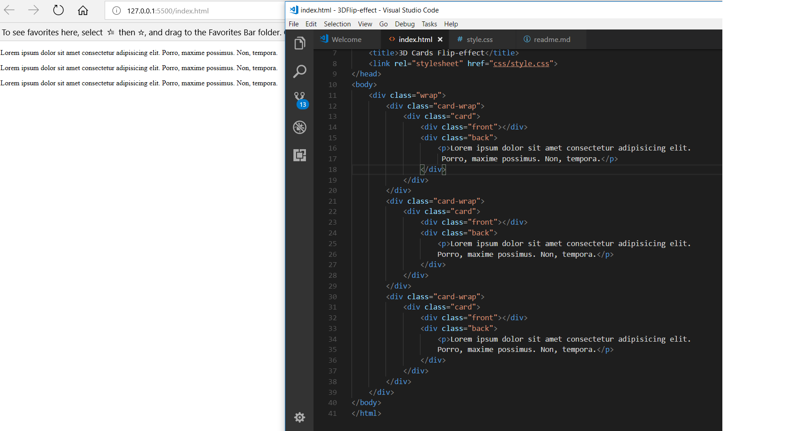
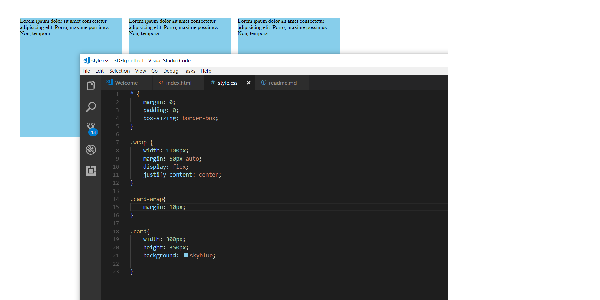
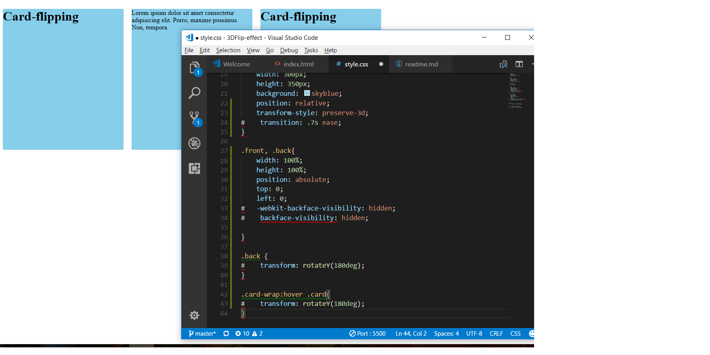
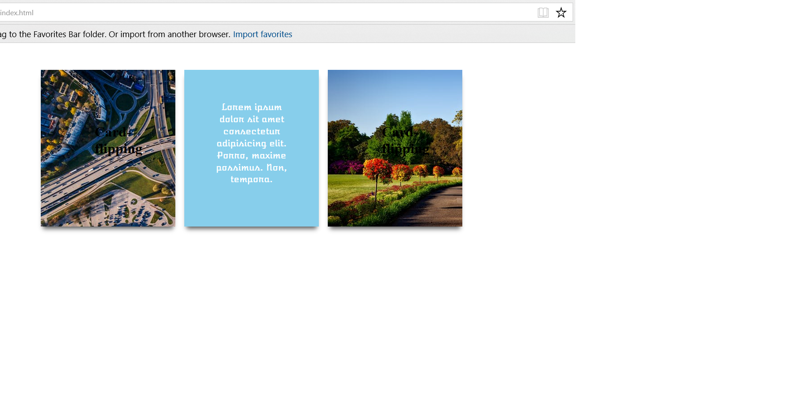

# Card flipping effect/ 3D

* Initial: the sections are just repeated for the division of the 3 cards

* Second screenshot shows the 3 seperate cards. In CSS, these are in box-sizing: border-box.

* Initial css for card-flipping

* Final output

source: https://www.youtube.com/watch?v=5mrkxGPzyK0