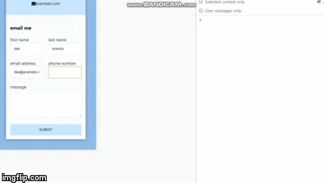

# contact form with firebase

This is a working contact form in connection to the portfolio website.

1. initially the elements were given ids, eg firstname, lastname, phone, email and message then the main.js was created

2. evenListener was then added to listen to submit

3. then the formvalues function was placed

4. get values was then added

5. firebase integration: create new firebase project. get id

6. place above the script, main.js

7. place var config of firebase at top of main.js

8. reference messages collection

