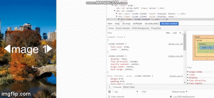

# IMAGE SLIDER

## FEATURES
* click arrow to slide images from left or right

## SAMPLE, Link: DeaLorenzo-parallel.surge.sh


### images
```
.slide-content {
    display: flex;
    flex-direction: column;
    justify-content: center;
    align-items: center;
    text-align: center;
}
``` 


### images2
```
    .slide-content {
    font-size: 5rem;
    color: white;
}
```


### images3
* with arrow
```
#arrow-left {
    border-color: transparent white transparent transparent;
    border-width: 30px 40px 30px 0;
    left: 0;
    margin-left: 30px;
}
```


## JS FUNCTION FOR SLIDING
```
        let sliderImages = document.querySelectorAll('.slide'),
        arrowLeft = document.querySelector('#arrow-left'),
        arrowRight = document.querySelector('#arrow-right'),
        current = 0;
        // clear images
        function reset(){
            for(let i = 0; i < sliderImages.length; i++){
                sliderImages[i].style.display = 'none';
            }

            // initialize slider
            function startSlide(){
                reset();
                sliderImages[0].style.display = 'block';
            }
        }

        // show previous
        function slideLeft(){
           reset();
           sliderImages[current - 1].style.display = 'block';
           current--; 
        }

        // show next
        function slideRight(){
            reset();
            sliderImages[current + 1].style.display = 'block';
            current++;
        }

        // left arrow click
        arrowLeft.addEventListener('click', function(){
            if(current === 0){
                current = sliderImages.length;
            }
            slideLeft();
        });

        // right arrow click
        arrowRight.addEventListener('click', function(){
            if(current === sliderImages.length - 1){
                current = -1;
            }
            slideRight();
        });
        
        startSlide();
```