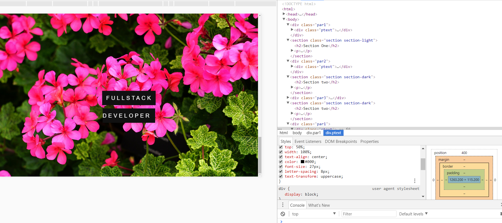

# Parallax Site

### Sample




* Simple parallax with simple html and css. This code snipett is just repeated to have different sections.
```
    <div class="par1">
        <div class="ptext">
            <span class="border">
                Dea Lorenzo
            </span>    
        </div>
    </div>

    <section class="section section-light">
    <h2>Section One</h2>
    <p>Lorem ipsum!</p>
    </section>
```

* images css
```
    position: relative;
    background-position: center;
    background-size:cover;
    background-repeat: no-repeat;
    background-attachment: fixed;
    min-height:100%;
```
