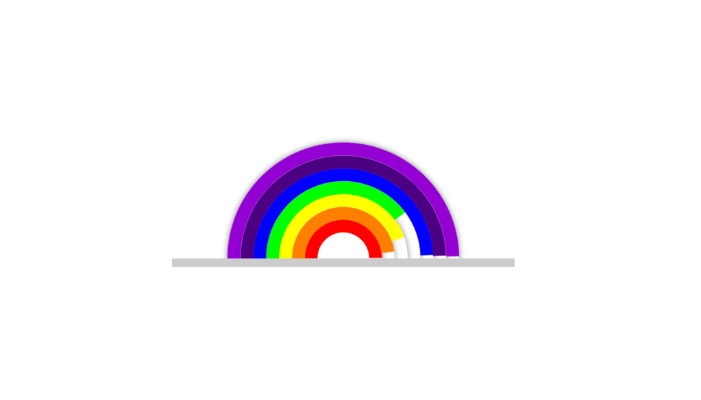

# CSS animation showing rainbow colors

* sample image

### link: http://rainbowcss-dealorenzo.surge.sh/

* index.html 
`
<body>
    

        <ul>
            <li></li>
            <li></li>
            <li></li>
            <li></li>
            <li></li>
            <li></li>
            <li></li>
        </ul>
    

`

* css 

`
li:nth-child(1)
{
    width: 60px;
    height: 60px;
    border-color: #f00;
    animation-delay: .2s;
}

`

* key frames for animation 

`
@keyframes animate 
{
    0%
    {
        transform: translate(-50%, -50%) rotate(-45deg);
    }
    100%
    {
        transform: translate(-50%, -50%) rotate(-315deg);
    }
}
`

* sources: https://www.webnots.com/vibgyor-rainbow-color-codes/

